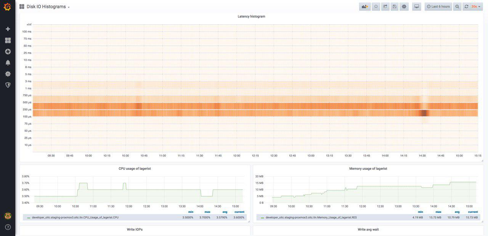

# Lagerist

Lagerist is a daemon that runs kernel traces to gather disk IO statistics, which
are exposed as Histograms in the Prometheus format. The result, when graphed using
[the Grafana dashboard](grafana-dashboard.json) attached, looks like this:



# Running Lagerist

Easiest via Docker:

```
docker run -d --name lagerist \
    --privileged \
    -v /proc:/proc \
    -v /dev:/dev:ro \
    -v /sys:/sys \
    -p 9165:9165 \
    svedrin/lagerist:latest
```
